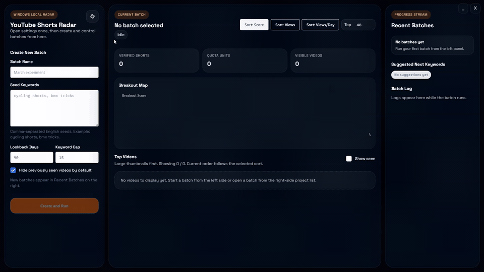

# AI YouTube Shorts Radar

[English](./README.md) | [中文](./README.zh-CN.md)

## Demo

[](./demo.mp4)

The preview above is a GIF for GitHub. Click it to open the full-quality [demo.mp4](./demo.mp4).

> Free AI-powered YouTube Shorts trend finder.
>
> Find the next hot topic for your Shorts. No subscription. No paid LLM API key.

Making YouTube Shorts is not just about editing.
It is about finding the next topic before everyone else does.

**AI YouTube Shorts Radar** is built for that:

- Enter one seed keyword
- Use free AI to expand more angles
- Spot high-view and fast-growing Shorts
- Save results locally for later review

## What Problem It Solves

Shorts research is usually painful:

- Manual keyword search is slow
- Fast-rising topics are easy to miss
- One viral video does not tell you what to make next
- Too many tabs, not enough clear direction

The goal is simple:

**Help Shorts creators find the next hot topic faster, for free.**

## Why Use It

- Built for Shorts creators, not for bloated analytics workflows
- Focused on rising content, not just old viral hits
- Free to use, with no subscription
- AI expands your keyword ideas without requiring a paid LLM API key
- Research results are saved, so you do not start from zero every time

## Who It Is For

- Shorts creators looking for the next angle
- Faceless channel builders
- Studios, editors, and operators doing topic research
- Anyone who does not want another monthly tool bill

## Quick Start

A ready-to-use release already supports Windows 10 and Windows 11.

If you want to build from source, you need:

- Windows 10/11
- Go 1.25+
- WebView2 Runtime
- A free YouTube Data API key

Run:

```powershell
go build -ldflags "-H windowsgui" -o .\bin\app.exe .\cmd\app
.\bin\app.exe
```

Then:

1. Add your YouTube API key
2. Enter a keyword
3. Let AI expand more directions
4. Review the Shorts that are gaining traction

## Star Goals

- `500 Stars`: macOS and Linux support
- `2k Stars`: online version

If this project helps you, give it a Star.

## In One Line

If you make YouTube Shorts, this project does one job:

**Help you find the next hot topic faster, for free.**

## License

MIT. See [LICENSE](./LICENSE).
